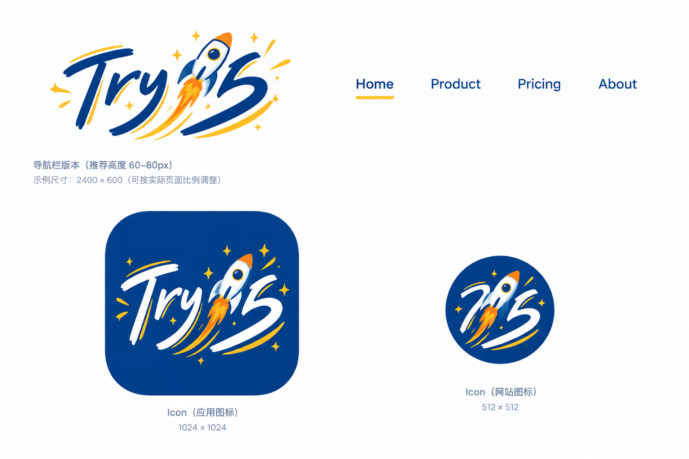
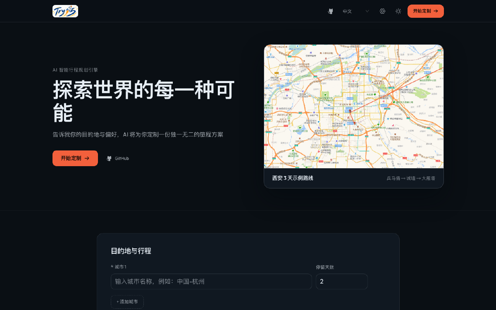
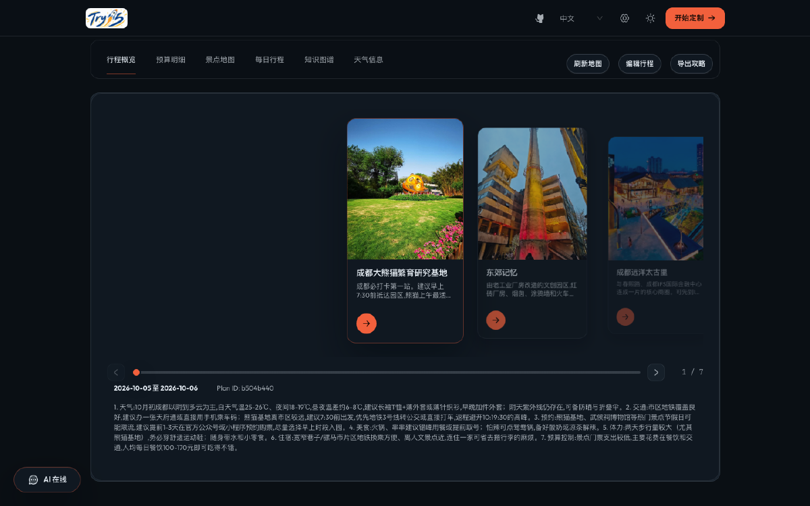
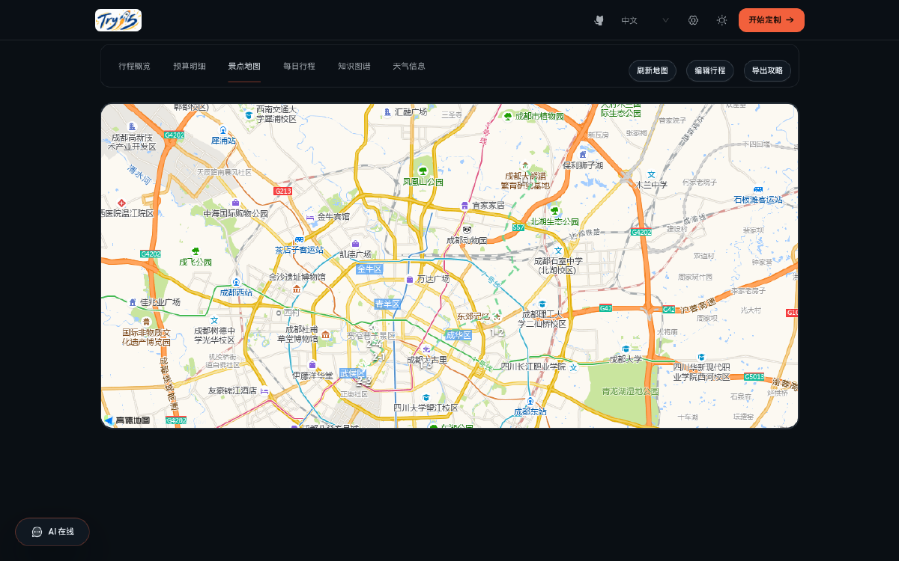
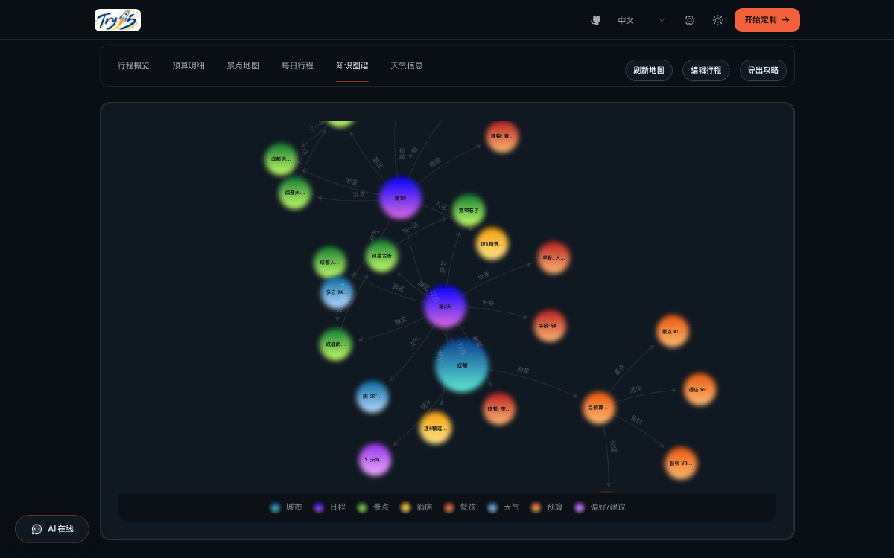
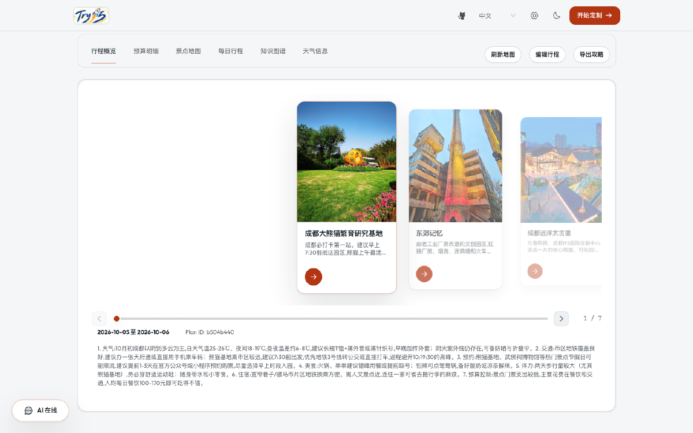

<div align="center">
  

# 旅游大王 (Travel King)

**AI 文旅行程规划助手**：说出目的地与偏好，自动产出可执行的行程方案

[](LICENSE)
[](https://vuejs.org/)
[](https://fastapi.tiangolo.com/)
[](https://www.python.org/)

[中文](README.md) | [English](README_en.md) | [日本語](README_ja.md)

</div>

---

## 复刻声明

> **本项目复刻自 [1sdv/TripStar](https://github.com/1sdv/TripStar)**（原作者：1sdv 及贡献者），并遵循原项目的 **GPL-2.0** 许可证进行二次开发与发布。
>
> 本项目在原项目基础上做了界面重设计、日间模式、行程预览交互重构、景点配图降级链路、品牌更名等修改，具体改动清单见 [NOTICE](NOTICE)。上游项目的全部版权与署名归原作者所有，本项目不代表原作者的立场，也未获得原作者的背书。
>
> 若你是原作者并希望调整署名方式或下架本项目，请通过 Issue 联系。

> 📌 **使用前请先阅读 [项目声明](DECLARATION.md)**：包含来源署名、非商业使用范围、第三方服务合规与隐私说明。

## 这是什么

规划一次旅行通常要在多个平台之间来回切换：翻游记、查天气、比酒店、算预算、排路线。旅游大王把这些环节收敛到一个界面：**你只描述目的地与偏好，系统产出一份可直接执行的行程**。

它不是一个静态的攻略列表，而是一份可核对的方案：景点带地址与建议时长、需要提前预约的会显式标注、交通有具体建议、餐饮有推荐与价格、预算分项可展开核对，配地图与知识图谱，生成后还能针对细节继续追问。

## 核心功能

| 功能 | 说明 |
| --- | --- |
| 行程生成 | 提交后异步生成，前台实时显示阶段进度（搜索景点 / 查询天气 / 生成计划），长任务不触发网关超时 |
| 多城市行程 | 一次出行串多个城市，各自设置停留天数，总天数与城际交通自动汇总 |
| 景点素材提纯 | 从真实游记中检索景点并结构化（名称、推荐理由、建议时长、预约提示），并用地理编码补齐坐标 |
| 天气与酒店 | 按行程日期与城市查询天气，按住宿偏好检索酒店并计入预算 |
| 预算明细 | 门票 / 餐饮 / 住宿 / 交通 / 城际交通分项汇总，可展开核对 |
| 景点地图 | 真实经纬度标记与连线，支持主题联动的底图样式 |
| 每日行程 | 按天展示景点顺序、时长、交通、餐饮与住宿建议，含防坑提示 |
| 知识图谱 | 将「城市 → 天数 → 景点/餐饮/住宿/预算」渲染为可交互关系图 |
| AI 行程问答 | 带完整行程上下文的追问（票价、适宜性、换乘等），提供快捷提问 |
| 攻略图导出 | 一键导出包含行程、预算、地图与天气的长图，便于分享 |
| 多语言 | 界面与生成内容支持中文 / 英文 / 日文 |
| 日间与夜间主题 | 默认跟随系统，可手动切换并持久保存；地图与图谱同步换色 |
| 本地优先 | 密钥与数据都留在本机，无需注册账号，任务与图片缓存存本地文件 |

## 界面预览

| 首屏 | 行程概览 |
| --- | --- |
|  |  |

| 景点地图 | 知识图谱 |
| --- | --- |
|  |  |

日间模式（默认跟随系统，可手动切换并持久保存）：



## 快速开始

### 1. 环境要求

| 依赖 | 版本 | 用途 |
| --- | --- | --- |
| Python | 3.10+ | 后端服务（可用 [uv](https://docs.astral.sh/uv/) 自动安装） |
| Node.js | 18+ | 前端构建、小红书请求签名 |
| npm | 随 Node 提供 | 依赖安装与构建 |

### 2. 获取代码

```bash
git clone https://github.com/gladstoneluda96-apiu/travel-king.git
cd travel-king
```

### 3. 配置密钥

复制配置模板并填写：

```bash
cp .env.example .env                 # 服务端配置
cp frontend/.env.example frontend/.env   # 前端构建期配置
```

需要准备四类凭据（也可以先留空启动，进界面后用右上角「设置」弹窗填写，保存即生效）：

| 配置项 | 必填 | 用途与获取方式 |
| --- | --- | --- |
| `LLM_API_KEY` / `LLM_BASE_URL` / `LLM_MODEL_ID` | 是 | 任意兼容 OpenAI 协议的服务（示例使用 DeepSeek）。需选择具备长结构化输出能力的模型 |
| `VITE_AMAP_WEB_KEY` | 是 | 高德「Web 服务」类型 Key：地理编码、天气、POI、静态地图。[申请入口](https://lbs.amap.com/) |
| `VITE_AMAP_WEB_JS_KEY` / `VITE_AMAP_SECURITY_JS_CODE` | 是 | 高德「Web端(JS API)」类型 Key 与其安全密钥，用于地图渲染（构建期注入） |
| `XHS_COOKIE` | 可选 | 小红书网页端登录后的 Cookie（含 `a1`、`web_session`、`webId`）。**未配置时自动使用高德景点素材与配图**，不影响行程生成 |
| `GOOGLE_MAPS_API_KEY` / `GOOGLE_MAPS_PROXY` | 可选 | 需要 Google 地图引擎时填写（未配置则使用高德） |

### 4. 启动

**方式一：一键脚本（macOS）**

也可以在 Finder 里直接双击 `scripts/启动旅游大王.command`（启动并自动打开浏览器）与 `scripts/停止旅游大王.command`；脚本会自检依赖、首次运行自动装配环境。

```bash
bash scripts/install-service.sh     # 首次：注册常驻服务（开机自启、异常自动重启）
bash scripts/local-start.sh         # 启动
bash scripts/local-stop.sh          # 停止
bash scripts/uninstall-service.sh   # 卸载
```

**方式二：手动启动（跨平台）**

```bash
# 后端依赖（首次）
uv venv backend/.venv --python 3.10
uv pip install --python backend/.venv/bin/python -r backend/requirements.txt
cd backend && npm install && cd ..        # 小红书签名引擎的 Node 依赖

# 前端构建（首次，产物由后端同源托管）
cd frontend && npm install && npx vite build && cd ..

# 启动服务
cd backend && .venv/bin/uvicorn app.api.main:app --host 0.0.0.0 --port 7870
```

打开 <http://localhost:7870> 即可使用，接口文档在 <http://localhost:7870/docs>。

> 服务只需要这样一个进程：接口与前端界面同源托管。天气 / 酒店所需的高德 MCP 服务与小红书签名引擎都由主服务按需拉起，无需单独启动，也没有数据库需要部署。

## 运行机制（简要）

```
浏览器 ──POST /api/trip/plan──▶ 立即返回 task_id（异步任务）
   │                                  │
   │                        并发取数：景点素材 + 天气 + 酒店
   │                                  │
   │                        LLM 聚合生成结构化行程（含 JSON 容错修复）
   │                                  │
   └──轮询 /api/trip/status/{id}──◀ 任务状态落盘，完成后返回行程与知识图谱
```

景点配图采用三级降级：**小红书实拍图 → 高德 POI 照片 → 设计占位块**，并对失败结果做短时缓存与限流冷却，避免持续触发平台风控。

更完整的架构说明、模块划分与设计决策见 [项目文档/01-技术大纲.md](项目文档/01-技术大纲.md)。

## 目录结构

```
travel-king/
├── backend/                 # FastAPI 后端
│   ├── app/api/routes/      # 行程 / 景点 / 地图 / 问答 / 设置 / 记忆
│   ├── app/services/        # 小红书、高德、LLM、知识图谱等业务封装
│   ├── app/agents/          # 多智能体编排（主控 + 天气 + 酒店）
│   └── app/memory/          # 用户偏好记忆
├── frontend/                # Vue 3 前端
│   ├── src/views/           # Landing（首屏 + 表单）、Result（行程结果页）
│   ├── src/components/      # 导航、行程预览轨道、景点卡片、AI 问答
│   ├── src/styles/          # 设计令牌与基础样式
│   └── src/i18n/locales/    # 中 / 英 / 日 文案
├── scripts/                 # 启动、停止、服务注册脚本
├── pictures/                # 品牌设计稿与裁剪结果
├── docs/images/             # README 界面截图
├── 项目文档/                 # 技术大纲、需求、测试、迭代与验收报告
├── Dockerfile               # 容器构建（可选）
└── docker-compose.yaml      # 容器编排（可选）
```

## 常见问题

| 现象 | 原因与处理 |
| --- | --- |
| 行程生成失败并提示 Cookie 未配置 | 部署版本若将小红书设为必需，请填写 `XHS_COOKIE`；本项目已实现无 Cookie 降级，正常应能继续生成 |
| 景点图片显示为占位块 | 小红书搜索触发风控时会返回空结果，系统会自动改用高德图片；若两者都未命中则显示占位。可稍后重试或在设置中更新小红书 Cookie |
| 小红书 Cookie 失效 | 网页端重新登录后，从开发者工具复制请求头中的 Cookie 字符串更新即可（含 `a1`、`web_session`、`webId`） |
| 地图空白 | 检查高德「Web端(JS API)」Key 与安全密钥是否正确，修改后需重新构建前端 |
| 端口被占用 | 修改 `.env` 里的 `PORT`，或先执行 `bash scripts/local-stop.sh` |
| 服务起不来 | 查看日志 `~/Library/Logs/TripDesign/tripstar.log`（macOS），确认 Python / Node 依赖已安装 |

## 技术栈

Vue 3.5 + TypeScript + Vite 6 · Ant Design Vue · vue-i18n · ECharts · 高德 JS API 2.0 · Phosphor Icons
FastAPI + uvicorn · hello-agents · fastmcp（高德 MCP）· PyExecJS（小红书签名）· OpenAI 兼容协议

## 许可证与致谢

- 本项目遵循 **GPL-2.0** 许可证，完整文本见 [LICENSE](LICENSE)
- 复刻来源：[1sdv/TripStar](https://github.com/1sdv/TripStar)，感谢原作者及贡献者
- 第三方组件与字体许可摘要见 [THIRD-PARTY-NOTICES.md](THIRD-PARTY-NOTICES.md)

### 使用范围提醒（重要）

本项目依赖 **HelloAgents**（<https://github.com/jjyaoao/HelloAgents>），其许可证为 **CC-BY-NC-SA-4.0（禁止商业使用 + 相同方式共享）**。这与 GPL-2.0 允许商业使用的要求无法同时满足，因此包含该依赖的整体分发应视为：

> **仅供个人学习与非商业用途**；涉及 HelloAgents 的部分需保留署名，并继续以 CC-BY-NC-SA-4.0 提供。

如需商业使用，或希望整体仅按 GPL-2.0 发布，需要先替换 HelloAgents 依赖（使用面较小：MCP 工具封装与智能体编排）。详见 [THIRD-PARTY-NOTICES.md 第 3 节](THIRD-PARTY-NOTICES.md)。

> 其它提醒：本项目会通过接口访问小红书、高德等第三方服务，请自行确认并遵守各平台的用户协议与使用条款；相关风险由使用者自行承担。本项目不内置、不分发任何第三方账号凭据。
